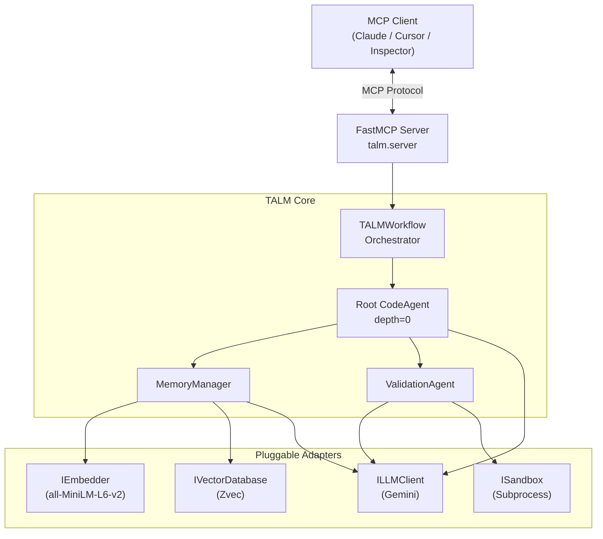
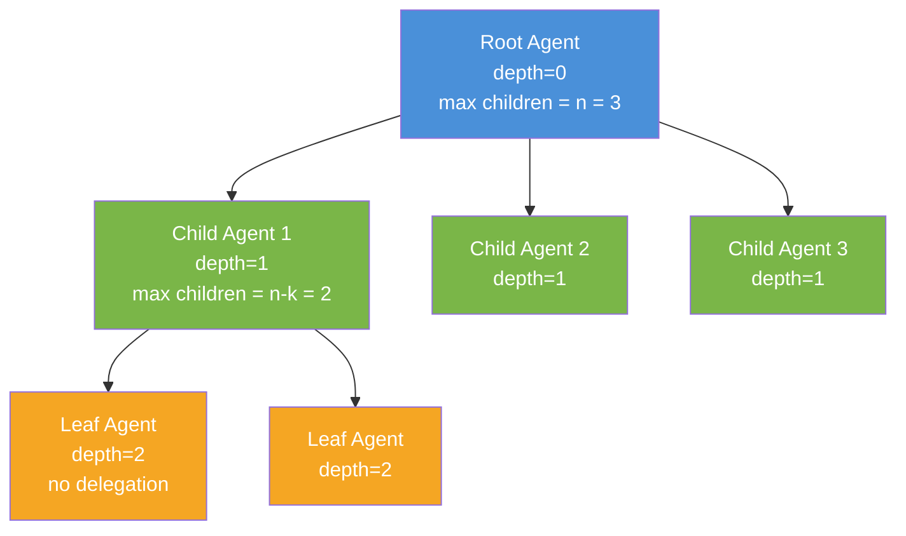
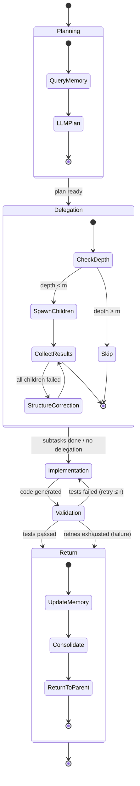
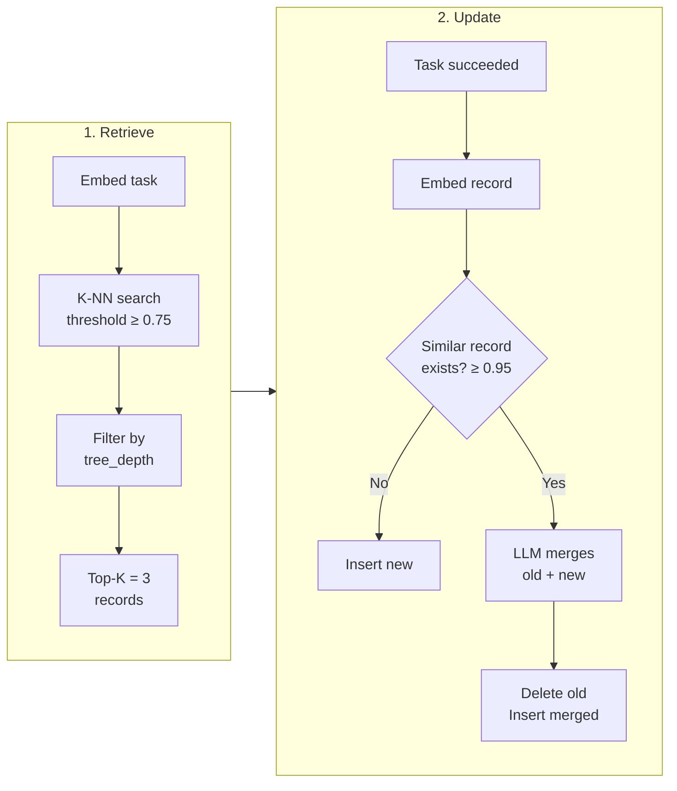
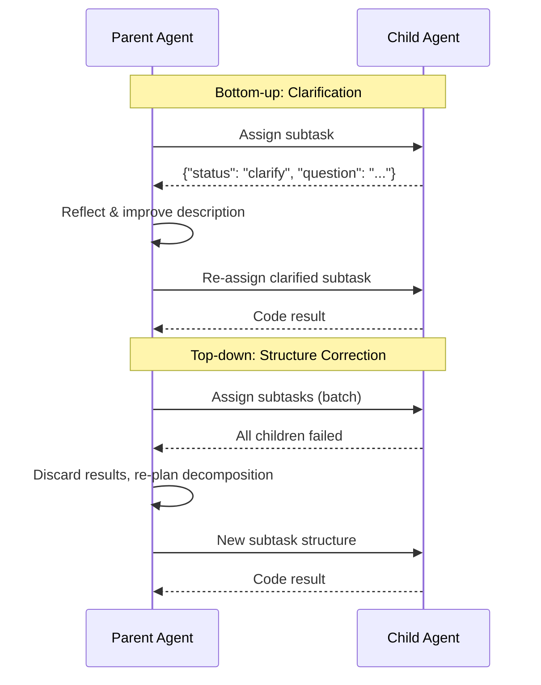

# TALM — Tree-Structured Multi-Agent Framework with Long-Term Memory

A reproduction of the [TALM paper](https://arxiv.org/abs/2510.23010): a multi-agent code generation framework that uses **tree-structured task decomposition**, **long-term vector memory**, and **localized re-reasoning** to produce validated Python code.

Exposed as an **MCP server** (via FastMCP) for integration with Claude, Cursor, or any MCP-compatible client.

## LongMemEval Benchmark

TALM's long-term memory is benchmarked against the **LongMemEval** dataset
([Wu et al., ICLR 2025](https://arxiv.org/abs/2410.10813)) — a 500-instance
benchmark that evaluates long-term memory across information extraction,
multi-session reasoning, knowledge updates, temporal reasoning, and abstention.

### Headline result (LongMemEval_S, full 470 answerable instances)

| System | Embedder size | session_recall@5 |
|---|---:|---:|
| BM25 | — | ~70% |
| Contriever | 110M | ~76% |
| Stella V5 | 1.5B | ~83% |
| GTE-Qwen2-7B | 7B | ~85% |
| **TALM (all-MiniLM-L6-v2)** | **22M** | **85.9%** |

TALM matches GTE-Qwen2-7B's published recall using an embedder **320× smaller**.
Run with `--seed 42`, `--top-k 5`, full 500-instance dataset (30 abstention
instances excluded by default since they have no ground-truth session locations).

**Per-question-type breakdown** (n = 470, top-k = 5):

| Question type | n | recall@5 | hit@1 |
|---|---:|---:|---:|
| single-session-assistant | 56 | **98.2%** | **98.2%** |
| knowledge-update | 72 | 87.5% | 77.8% |
| multi-session | 121 | 85.7% | 86.0% |
| single-session-preference | 30 | 83.3% | 50.0% |
| temporal-reasoning | 127 | 82.7% | 73.2% |
| single-session-user | 64 | 81.2% | 53.1% |
| **Overall** | **470** | **85.9%** | **76.0%** |

The weak spot is `single-session-user`: questions where the answer is one
sentence buried in a session whose dominant topic is something else (e.g.
*"Who gave me a new stand mixer?"* mentioned in passing during a long
discussion of caramel pastry recipes). Session-granularity embedding gets
washed out by the dominant topic. Adding turn-level indexing or
LongMemEval's "fact-augmented key expansion" would lift this number.

See [`docs/memory_benchmarking.md`](docs/memory_benchmarking.md) for the full
methodology, caveats, and a portable recipe for benchmarking any other
memory system the same way.

### Reproduce locally

```bash
# 1. Download the dataset (~280 MB total, gitignored)
mkdir -p data && cd data
wget https://huggingface.co/datasets/xiaowu0162/longmemeval-cleaned/resolve/main/longmemeval_s_cleaned.json
wget https://huggingface.co/datasets/xiaowu0162/longmemeval-cleaned/resolve/main/longmemeval_oracle.json
cd ..

# 2. Run a 5% smoke test (~40 s on CPU)
.venv/bin/python showcase/longmemeval_real.py --slice 25 --top-k 5 --seed 42

# 3. Run the full 500 instances for the publishable number (~13 min on CPU)
.venv/bin/python showcase/longmemeval_real.py --slice 500 --top-k 5 --seed 42 --json
```

A second harness, [`showcase/longmemeval_bench.py`](showcase/longmemeval_bench.py),
runs a synthetic 4-category benchmark (12 hand-crafted seeds + 14 queries) that
needs no dataset download and no API key. Use it as a fast pipeline check or
to ablate the retrieval threshold.

## Architecture

### System Overview



### Tree-Structured Agent Decomposition



### Code Agent 5-Phase Lifecycle



### Long-Term Memory Lifecycle



### Localized Re-Reasoning



### Pluggable Adapters

| Component      | Default                          | Alternatives         |
| -------------- | -------------------------------- | -------------------- |
| **LLM**        | Google Gemini (`gemini-2.0-flash`) | Extend `ILLMClient`  |
| **Embedding**  | `all-MiniLM-L6-v2` (sentence-transformers, 384-dim) | Gemini embeddings    |
| **Vector DB**  | Zvec (Alibaba, cosine)           | ChromaDB             |
| **Sandbox**    | Subprocess (Python)              | Docker / E2B         |

All adapters are swappable via `config.yaml` — no code changes needed.

## Quick Start

```bash
# 1. Create venv and install
python3 -m venv .venv
source .venv/bin/activate
pip install -e .

# 2. Set your Gemini API key
export GOOGLE_API_KEY="your-key-here"

# 3. Run the MCP server with Inspector
npx @modelcontextprotocol/inspector python -m talm.server

# Or run the demo directly
python demo.py      # simple task
python demo.py 1    # complex task (multi-module)
```

## MCP Tools

| Tool                   | Description                                     |
| ---------------------- | ----------------------------------------------- |
| `generate_code`        | Full tree-structured multi-agent code generation |
| `generate_code_simple` | Single-agent mode (no tree decomposition)        |
| `get_config`           | View current hyperparameters                     |
| `update_config`        | Modify hyperparameters at runtime                |
| `get_memory_stats`     | Check long-term memory record count              |
| `clear_memory`         | Reset long-term memory (for evaluation runs)     |

## Configuration

All hyperparameters are in [`config.yaml`](config.yaml):

```yaml
tree:
  max_depth: 3          # m
  initial_branching: 3  # n
  decay_rate: 1         # k

validation:
  max_retries: 3        # r

memory:
  similarity_threshold: 0.75
  top_k: 3
  merge_threshold: 0.95

embedding:
  provider: "sentence_transformers"   # or "gemini"
  model: "all-MiniLM-L6-v2"

vector_db:
  provider: "zvec"                    # or "chroma"
```

## Project Structure

```
src/talm/
├── core/
│   ├── entities.py             # Task, AgentResult, MemoryRecord, TALMConfig
│   └── interfaces.py           # ILLMClient, IEmbedder, IVectorDatabase, ISandbox
├── agents/
│   ├── code_agent.py           # 5-phase recursive Code Agent
│   └── validation_agent.py     # Test generation + debug loop
├── memory/
│   └── manager.py              # Retrieve, Update, Consolidate
├── infrastructure/
│   ├── llm_gemini.py           # Gemini LLM adapter
│   ├── embedder_st.py          # sentence-transformers embedder
│   ├── embedder_gemini.py      # Gemini embedder (alternative)
│   ├── vector_db_zvec.py       # Zvec adapter (primary)
│   ├── vector_db.py            # ChromaDB adapter (alternative)
│   └── sandbox.py              # Subprocess sandbox
├── prompts/
│   └── templates.py            # Prompt templates for all phases
├── config.py                   # YAML loader + adapter factories
├── workflow.py                 # TALMWorkflow orchestrator
└── server.py                   # FastMCP server entry point
```

## Key TALM Mechanisms

- **Tree-structured decomposition**: tasks split recursively with branching factor `n - k * depth`, capped at depth `m`
- **Depth-filtered memory**: retrieval only returns records from the same tree depth (matching granularity)
- **Memory consolidation**: near-duplicate records (similarity > 0.95) are merged via LLM synthesis to prevent bloat
- **Localized re-reasoning**:
  - *Bottom-up*: child agents request clarification when tasks are ambiguous
  - *Top-down*: parent agents discard and restructure failed subtree decompositions
- **Validation loop**: LLM-generated tests run in sandbox with up to `r` debug retries

## Environment Variables

| Variable                 | Required | Description           |
| ------------------------ | -------- | --------------------- |
| `GOOGLE_API_KEY`         | Yes      | Gemini API key        |
| `GOOGLE_CLOUD_PROJECT`   | No       | For Vertex AI         |
| `GOOGLE_CLOUD_LOCATION`  | No       | For Vertex AI         |

## License

Research reproduction — refer to the original TALM paper for academic use.
