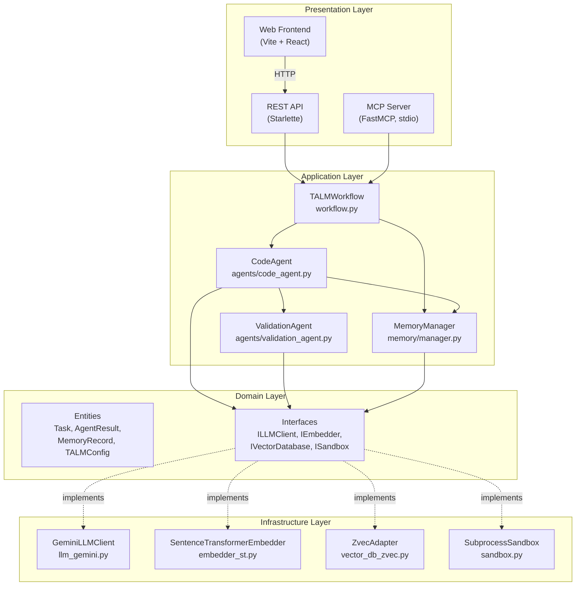
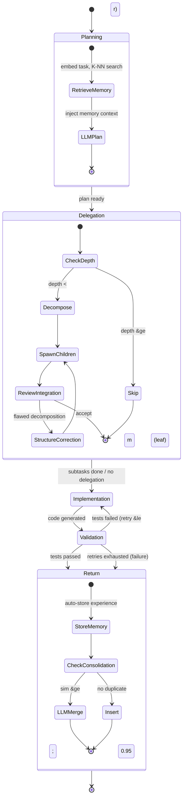
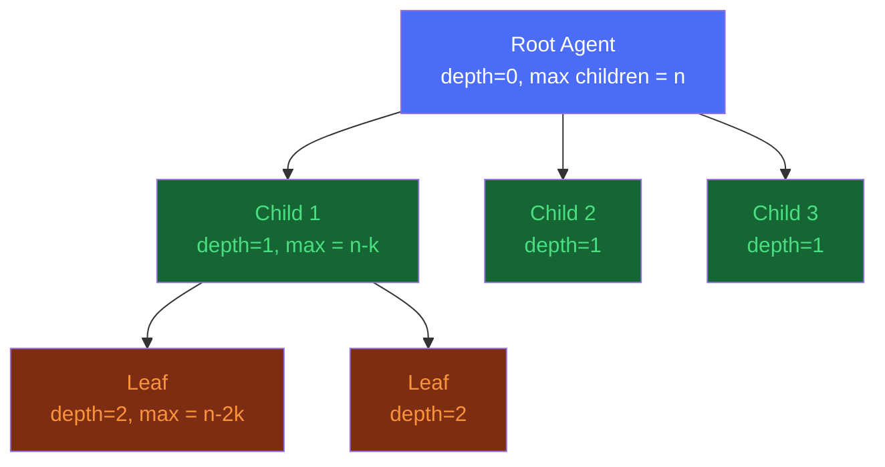
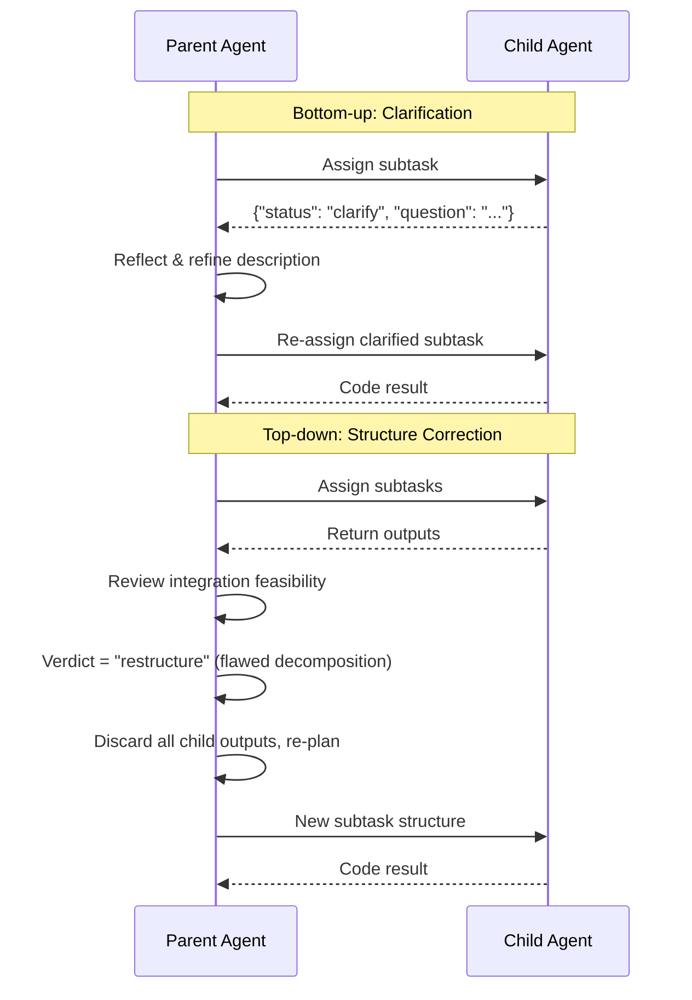
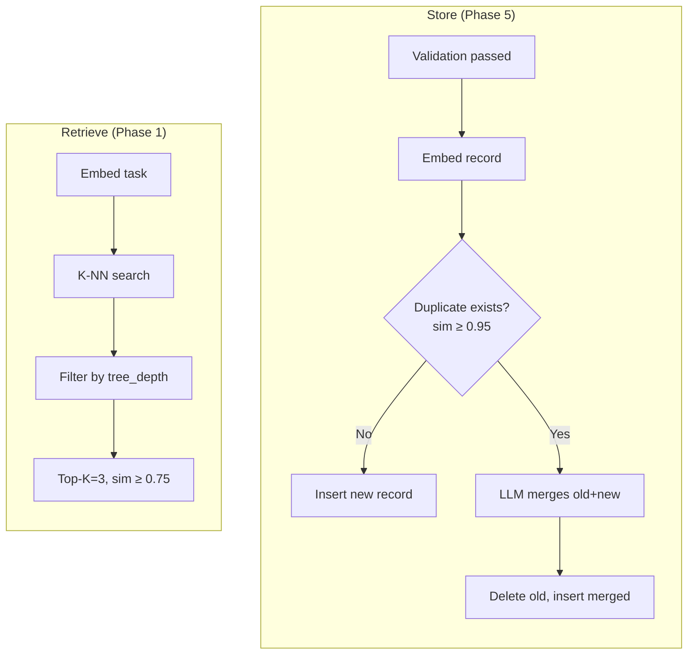

# Architecture

TALM follows **Clean Architecture** with the Dependency Inversion Principle — core logic depends on interfaces, not concrete implementations.

## Layer Diagram



## Dependency Flow

```
Presentation → Application → Domain ← Infrastructure
```

- **Domain** has zero external dependencies (pure Python dataclasses + ABCs)
- **Application** depends only on Domain interfaces
- **Infrastructure** implements Domain interfaces with real libraries
- **Presentation** wires everything together via `config.py` factories

## Code Agent 5-Phase Lifecycle



## Tree-Structured Decomposition



The tree is **not predefined** — the LLM dynamically decides at each node whether to decompose (return subtask JSON) or solve directly (return `NO_DELEGATION`). The `m, n, k` hyperparameters constrain the shape:

- `m=3`: max depth (nodes at depth m are forced leaves)
- `n=3`: root branching factor
- `k=1`: branching decays by k per level (3 → 2 → 1)

## Localized Re-Reasoning



## Long-Term Memory Pipeline



## Pluggable Adapters

All adapters are selected via `config.yaml` and instantiated by factory functions in `config.py`:

| Interface | Default Adapter | Alternative |
|-----------|----------------|-------------|
| `ILLMClient` | `GeminiLLMClient` (gemini-2.5-flash) | Extend for OpenAI, local models |
| `IEmbedder` | `SentenceTransformerEmbedder` (all-MiniLM-L6-v2, 384-dim) | `GeminiEmbedder` (768-dim) |
| `IVectorDatabase` | `ZvecAdapter` (Alibaba Zvec, cosine) | `ChromaDBAdapter` |
| `ISandbox` | `SubprocessSandbox` | Docker, E2B |

To swap: change the `provider` field in `config.yaml`, no code changes needed.
